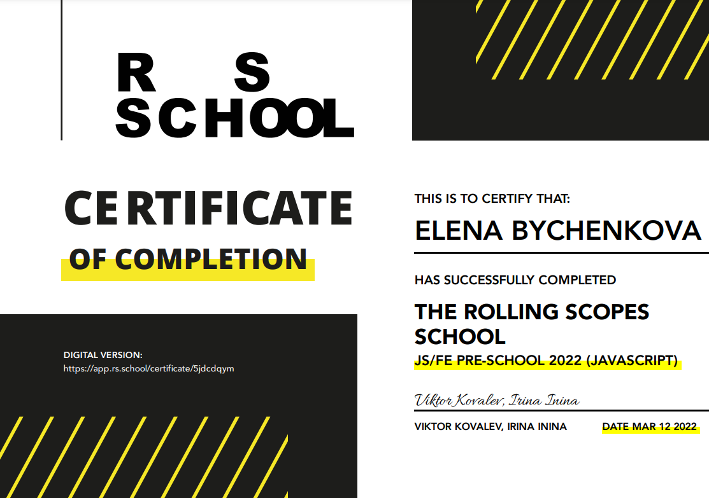
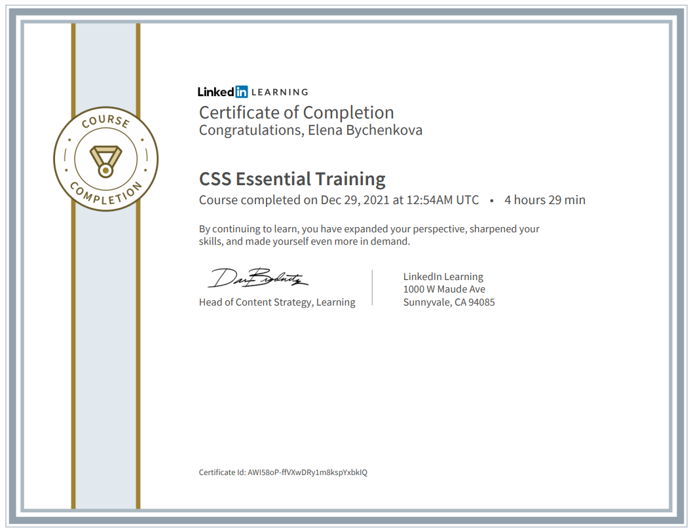
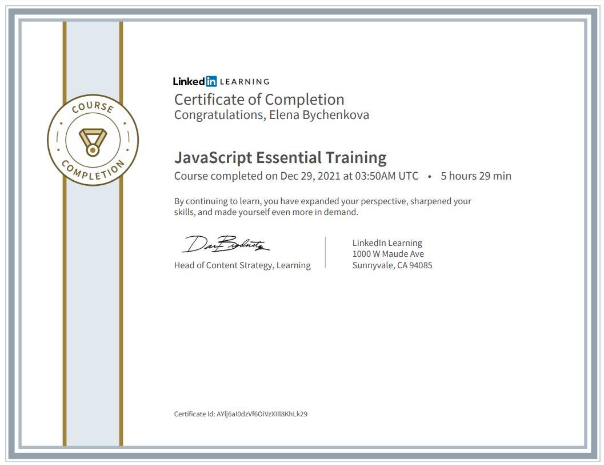
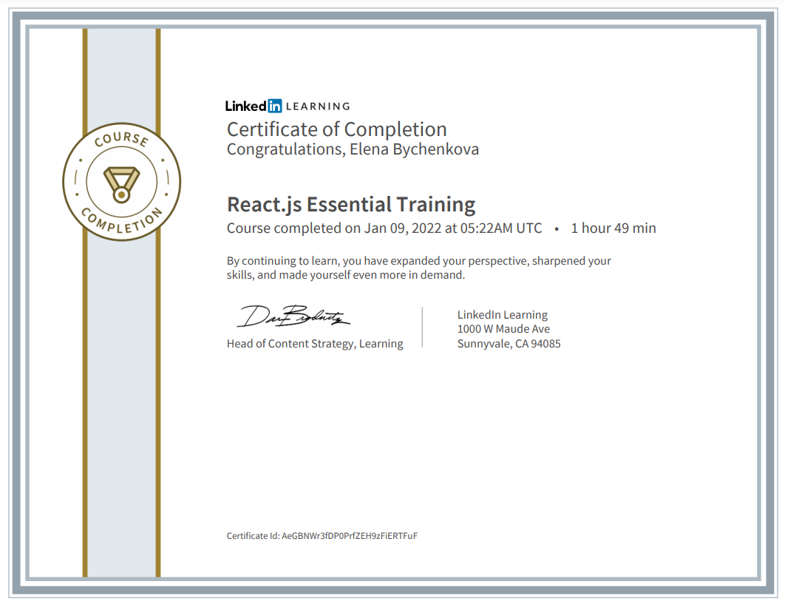

********* 
# Elena Bychenkova
## Software Engineer

********* 

Passionate software engineer with a strong mathematical background.
Over seven years of experience in the software industry in a variety of roles
with a range of technologies and several programming languages.
Excellent analytical, design, and problem-solving abilities.
Highly motivated and committed to delivering the highest standard of work.
A constant learner who loves to learn something new.
Currently focusing on front-end development.

********* 

## _Contacts_  
**E-mail:** elena.bychenkova@gmail.com  
**LinkedIn:** [Elena-Bychenkova](https://www.linkedin.com/in/elena-bychenkova/)  
**GitHub:** [ElenaByc](https://github.com/ElenaByc)  
**Telegram:** [@ElenaByc](https://t.me/elenabyc)  

********* 

## _Skills_
* Java
* C++
* ABAP
* Python
* JavaScript
* HTML5
* CSS  
  
  
********* 
[](https://www.codewars.com/users/ElenaByc)  

## _Code Example_
Java
7 kyu Fibonacci kata from [codewars](https://www.codewars.com/kata/57a1d5ef7cb1f3db590002af)  

```java
public class Fibonacci {
    public static long fib (int n) {
        if (n == 0 || n == 1) {
            return 1;
        }
        long curr = 1;
        long prev = 1;
        for (int i = 3; i <= n; i++) {
            curr = curr + prev;
            prev = curr - prev;
        }
        return curr;
    }
}
``` 

********* 

## _Education_
**Lomonosov Moscow State University (MSU), Moscow, Russia**  
MS in Mathematics, Applied Mathematics  
  
**Las Positas College, Livermore, CA, USA**  
ESL (English as a Second Language) Program

********* 

## _Courses&Certificates_
**THE ROLLING SCOPES SCHOOL  
JS/FE PRE-SCHOOL 2022 (JAVASCRIPT)**  
  
[](https://rs.school/js-stage0/)
  
  
**LinkedIn Learning  
HTML Essential Training**  
[](https://www.linkedin.com/learning/html-essential-training-4)


**LinkedIn Learning  
CSS Essential Training**  
[](https://www.linkedin.com/learning/css-essential-training-3/)
  
  
**LinkedIn Learning  
JavaScript Essential Training**  
[](https://www.linkedin.com/learning/javascript-essential-training/)
  
  
**LinkedIn Learning  
React.js Essential Training**  
[](https://www.linkedin.com/learning/react-js-essential-training/)


********* 

## _Projects_
[Portfolio](https://elenabyc.github.io/photographer-portfolio/) - RSS Stage0 Project  
[Memory Game](https://elenabyc.github.io/memory-game/) - RSS Stage0 Project  
[Image Galery](https://elenabyc.github.io/image-galery/) - RSS Stage0 Project  
[Shelter](https://elenabyc.github.io/shelter/pages/main/) - RSS Stage1 Project

********* 

## _Languages_
**English** Professional working proficiency
**Russian** Native language  


