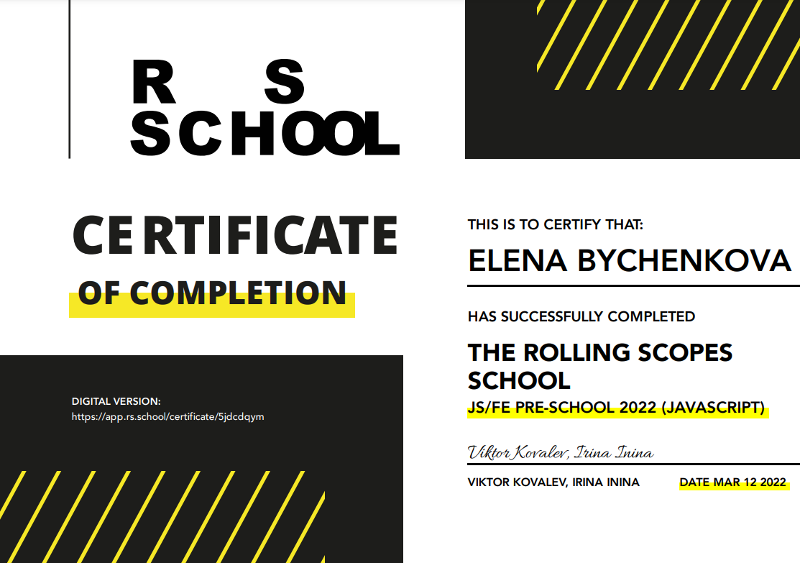

********* 
# Elena Bychenkova
## Software Engineer

********* 

Passionate software engineer with strong mathematical background. Over seven years of experience in the software industry in a variety of roles with a range of technologies and several programming languages. Excellent analytical, design, and problem-solving abilities. Highly motivated and committed to delivering the highest standard of work. Love to learn something new. Currently studying front end development.

********* 

## _Contacts_  
**E-mail:** elena.bychenkova@gmail.com  
**LinkedIn:** [Elena-Bychenkova](https://www.linkedin.com/in/elena-bychenkova/)  
**GitHub:** [ElenaByc](https://github.com/ElenaByc)  
**Telegram:** [@ElenaByc](https://t.me/elenabyc)  

********* 

## _Skills_
* Java
* C++
* ABAP
* Python
* JavaScript
* HTML5
* CSS

********* 

## _Education_
**Lomonosov Moscow State University (MSU), Moscow, Russia**  
MS in Mathematics, Applied Mathematics  
  
**Las Positas College, Livermore, CA, USA**  
ESL (English as a Second Language) Program

********* 

## _Courses&Certificates_
**THE ROLLING SCOPES SCHOOL  
JS/FE PRE-SCHOOL 2022 (JAVASCRIPT)**  

  
**LinkedIn Learning
HTML Essential Training**  

********* 

## _Languages_
**Russian** Native language  
**English** Professional working proficiency

